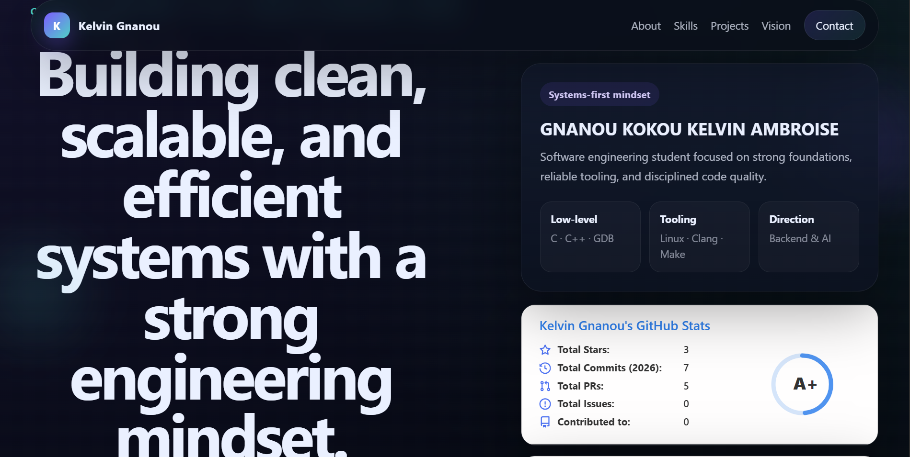

# Kelvin Gnanou — Engineering Portfolio

<div align="center">


### Computer Engineering Student · Software Engineering · Systems Programming

Focused on building strong foundations in low-level programming, backend systems, scalable software engineering, and artificial intelligence.

<br>

[](https://kelvin-gnanou.github.io)
[](https://github.com/kelvin-gnanou)
[](https://www.linkedin.com/in/kelvin-gnanou-a1755b40b/)

<br>


</div>

---

## Overview

This repository contains the source code of my personal engineering portfolio website.

The goal of this project is not only to present projects visually, but also to reflect a structured engineering mindset through:

- clean architecture,
- maintainable frontend structure,
- lightweight performance,
- modern UI principles,
- responsive design,
- and disciplined project organization.

This portfolio represents my progression toward backend engineering, systems programming, and artificial intelligence.

---

## Live Demo

<div align="center">

### 🌍 Website

#### https://kelvin-gnanou.github.io

</div>

---

## Preview



---

## Core Features

### UI / UX

- Modern dark-themed interface
- Premium glassmorphism-inspired components
- Responsive layout for desktop, tablet, and mobile
- Smooth scroll experience
- Scroll reveal animations
- Structured visual hierarchy
- Lightweight interactions without heavy frameworks

---

## Engineering Focus

This portfolio emphasizes:

- software engineering discipline,
- structured frontend architecture,
- maintainability,
- scalability mindset,
- clean organization,
- and engineering consistency.

---

## Technical Features

- Smooth section reveal animations using Intersection Observer
- Dynamic active navigation state
- SVG favicon branding
- Responsive CSS Grid layouts
- Lightweight vanilla JavaScript architecture
- GitHub stats integration
- Modular styling structure

---

## Tech Stack

<div align="center">

| Category   | Technologies                |
|------------|-----------------------------|
| Frontend   | HTML5 · CSS3 · JavaScript   |
| Styling    | Modern CSS · Flexbox · Grid |
| Tooling    | Git · GitHub · VS Code      |
| Deployment | GitHub Pages                |

</div>

---

## Project Structure

```bash
portfolio/
│
├── index.html
├── style.css
├── script.js
├── assets/
│   ├── preview.png
│   └── favicon.svg
└── README.md
```

---

## Sections Included

### Hero Section

Professional introduction with:
- personal branding,
- engineering direction,
- quick navigation,
- GitHub integration.

---

## About Section

Overview of:
- engineering philosophy,
- learning orientation,
- technical interests,
- long-term goals.

---

## Skills Section

### Languages

- Python
- C
- C++
- JavaScript
- SQL
- HTML/CSS

### Computer Science Fundamentals

- Data Structures & Algorithms
- Complexity Analysis
- Problem Solving
- Algorithmic Thinking

### Systems & Tooling

- Linux / Ubuntu / WSL
- GCC / Clang
- GDB
- Makefile
- Git / GitHub
- VS Code

### Software Quality

- Debugging
- Refactoring
- Static analysis
- Linting
- Formatting
- Modular design

---

## Featured Projects

### 🔹 Data Structures in C

Low-level implementations of fundamental data structures focused on:

- memory management,
- modular design,
- engineering clarity,
- and internal system understanding.

#### Includes
- Linked Lists
- Stacks / Queues
- Trees
- Memory handling

#### Tech

C · GCC · GDB · Makefile

---

### 🔹 Dev Environment Engineering

A structured development environment focused on:

- reproducibility,
- debugging,
- warning management,
- formatting pipelines,
- linting pipelines,
- modular project architecture.

#### Tech

Linux · GCC · Clang · Makefile · VS Code

---

### 🔹 Python Utilities & Automation

Small Python utilities designed to:
- automate repetitive tasks,
- improve workflow efficiency,
- practice structured scripting.

#### Tech

Python · CLI · File Handling

---

### 🔹 Web Interfaces

Frontend interfaces built to practice:
- responsive design,
- DOM manipulation,
- modern UI structuring.

#### Tech

HTML · CSS · JavaScript

---

## Current Focus

I am currently investing most of my learning effort into:

- memory management in C,
- low-level systems understanding,
- data structures implementation,
- backend engineering fundamentals,
- Linux development workflows,
- software quality practices,
- artificial intelligence foundations.

---

## Engineering Philosophy

<div align="center">

### “Build clean before building complex.”

</div>

Core principles behind this portfolio:

- Understand fundamentals deeply
- Prefer maintainability over quick hacks
- Build reproducible systems
- Focus on engineering clarity
- Improve continuously through practice
- Treat tooling as part of engineering quality

---

## Performance & Design Goals

This portfolio was designed with attention to:

- lightweight loading,
- minimal dependencies,
- readability,
- maintainability,
- scalability,
- and responsive behavior.

The objective is to keep the project:
- clean,
- understandable,
- extensible,
- and engineering-oriented.

---

## Deployment

This website is deployed using GitHub Pages.

### Deployment Steps

```bash
1. Push repository to GitHub
2. Open Settings
3. Go to Pages
4. Select:
   Branch: main
   Folder: /root
5. Save
```

GitHub automatically publishes the website.

---

## Local Development

### Clone repository

```bash
git clone https://github.com/kelvin-gnanou/portfolio.git
```

---

### Open project

```bash
cd portfolio
```

---

### Run locally

Simply open:

```bash
index.html
```

or use a local development server.

---

## Future Improvements

Planned future upgrades include:

- dynamic GitHub API integration,
- project filtering system,
- downloadable CV section,
- advanced animations,
- AI-focused project showcase,
- backend-connected contact form,
- blog / technical notes section.

---

## Contact

<div align="center">

### GitHub

https://github.com/kelvin-gnanou

### LinkedIn

https://www.linkedin.com/in/kelvin-gnanou-a1755b40b/

### Email

kelvin.gnanou.dev@gmail.com

</div>

---

## Goal

The long-term objective behind this portfolio is to progressively build the profile of a software engineer capable of designing:

- clean systems,
- scalable architectures,
- maintainable software,
- efficient tooling,
- and robust engineering workflows.

---

<div align="center">

### Engineering discipline first.


</div>
